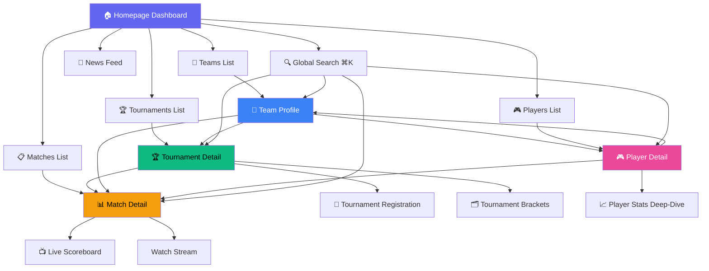

# E-Sports App — Research & Feature Breakdown

> **Project**: e-scores — Live Esports Tracker  
> **Stack**: Next.js 16 · React 19 · TypeScript · Tailwind CSS 4 · PandaScore API  
> **Date**: 2026-03-25

---

## 1. Competitor & Platform Analysis

| Platform | Strengths | Key Takeaway |
|---|---|---|
| **HLTV.org** | Deep CS2 stats, player ratings, event coverage | Detailed match pages with round-by-round data, HLTV rating system |
| **Liquipedia** | Wiki-style multi-game coverage, bracket visuals | Comprehensive team/player history, tournament bracket formats |
| **FACEIT** | Tournament hosting, matchmaking, ladder system | Registration flow with team management and anti-cheat integration |
| **Battlefy** | Self-serve tournament creation, bracket engine | Flexible bracket types (Swiss, double-elim, round-robin) |
| **Strafe** | Mobile-first live scores, push notifications | Clean scoreboard UI with real-time updates, spoiler-free mode |
| **VLR.gg** | Valorant-focused, community threads, player transfers | Match page economy/ability breakdowns, roster change tracking |
| **PandaScore** | Multi-game API, structured data | *Our primary data source* — live scores, tournaments, teams, players |

---

## 2. Feature List

### Core Features (✅ = Exists, 🔲 = Planned/Missing)

#### Data & Content
| # | Feature | Status | Description |
|---|---|---|---|
| F1 | Live Match Tracking | ✅ | Real-time scores with 15s auto-refresh |
| F2 | Tournament Browser | ✅ | Active/upcoming/past tournaments, tier filtering (S/A/B/C/D) |
| F3 | Team Profiles | ✅ | Roster, match history, win rates |
| F4 | Player Profiles | ✅ | Career stats, current team, match history |
| F5 | Match Details | ✅ | Game-by-game scores, streams, opponent info |
| F6 | Esports News | ✅ | Aggregated news feed with search |
| F7 | Tournament Registration | 🔲 | Register a team/solo for a tournament with confirmation flow |
| F8 | Live Scoreboard View | 🔲 | Dedicated real-time scoreboard with round/map progression |
| F9 | Player Stats Dashboard | 🔲 | Advanced stats: KDA, win-rate trends, performance graphs |
| F10 | Tournament Brackets | 🔲 | Visual bracket tree (single/double elimination, Swiss) |

#### Navigation & UX
| # | Feature | Status | Description |
|---|---|---|---|
| F11 | Global Search (⌘K) | ✅ | Quick-search across teams, players, tournaments, matches |
| F12 | Game Filtering | ✅ | Filter all content by game title |
| F13 | Dark / Light Theme | ✅ | System-aware with manual toggle |
| F14 | Multi-language (i18n) | ✅ | EN, TR, DE, ES, FR |
| F15 | Responsive Layout | ✅ | Mobile-first design |
| F16 | Pagination | ✅ | Paginated list views |

#### Future Enhancements
| # | Feature | Status | Description |
|---|---|---|---|
| F17 | User Accounts & Auth | 🔲 | Sign up/in, save favorites, follow teams/players |
| F18 | Push Notifications | 🔲 | Match start, score updates, tournament reminders |
| F19 | Streaming Integration | 🔲 | Embedded Twitch/YouTube streams on match pages |
| F20 | Betting Odds Display | 🔲 | Pre-match odds comparison |
| F21 | Social Sharing | 🔲 | Share match results / tournament links |

---

## 3. Screen List

### Current Screens (Already Implemented)

| # | Screen | Route | Description |
|---|---|---|---|
| S1 | **Homepage Dashboard** | `/` | Hero section, live matches, featured tournaments, quick nav |
| S2 | **Matches List** | `/matches` | Filterable list of live/upcoming/past matches |
| S3 | **Match Detail** | `/matches/[id]` | Game-by-game scores, teams, streams, opponent info |
| S4 | **Tournaments List** | `/tournaments` | Browse tournaments by status and tier |
| S5 | **Tournament Detail** | `/tournaments/[slug]` | Tournament info, schedule, participating teams |
| S6 | **Teams List** | `/teams` | Browse all teams with game filter |
| S7 | **Team Detail** | `/teams/[slug]` | Roster, stats, match history, tournament records |
| S8 | **Players List** | `/players` | Browse all players with game filter |
| S9 | **Player Detail** | `/players/[slug]` | Career stats, current team, recent matches |
| S10 | **News Feed** | `/news` | Aggregated esports news with search |
| S11 | **404 Not Found** | `*` | Custom error page |

### Proposed New Screens

| # | Screen | Route | Purpose |
|---|---|---|---|
| S12 | **Tournament Registration** | `/tournaments/[slug]/register` | Step-by-step tournament sign-up flow |
| S13 | **Live Scoreboard** | `/matches/[id]/scoreboard` | Full-screen real-time scoreboard for a match |
| S14 | **Player Stats Deep-Dive** | `/players/[slug]/stats` | Charts, graphs, advanced performance analytics |
| S15 | **Tournament Brackets** | `/tournaments/[slug]/brackets` | Visual bracket / group-stage view |

---

## 4. Key Page Content Specifications

### 4.1 Tournament Registration Page (`/tournaments/[slug]/register`)

```
┌─────────────────────────────────────────────┐
│  ← Back to Tournament                       │
│                                              │
│  ▸ Tournament Name & Logo                   │
│  ▸ Game • Date • Prize Pool • Region        │
│                                              │
│  ── Step 1: Choose Entry ──────────────────  │
│  ○ Solo Registration                         │
│  ○ Team Registration                         │
│                                              │
│  ── Step 2: Team Info (if team) ────────────  │
│  Team Name: [___________]                    │
│  Team Tag:  [___]                            │
│  Players:   + Add Player (via search)        │
│                                              │
│  ── Step 3: Confirm ───────────────────────  │
│  Rules acceptance checkbox                   │
│  Summary card — team, players, tournament    │
│  [ Register ]                                │
│                                              │
│  ── Step 4: Success ───────────────────────  │
│  ✓ Registration confirmed                    │
│  Tournament starts in X days, Y hours        │
│  [ View My Team ]  [ Back to Tournament ]    │
└─────────────────────────────────────────────┘
```

**Data needed**: Tournament details (API), user/team info (auth required).

---

### 4.2 Live Scoreboard (`/matches/[id]/scoreboard`)

```
┌─────────────────────────────────────────────┐
│  LIVE 🔴        CS2 • BO3        Map 2/3    │
│                                              │
│  ┌───────────┐          ┌───────────┐       │
│  │  Team A   │   13:9   │  Team B   │       │
│  │  [logo]   │          │  [logo]   │       │
│  └───────────┘          └───────────┘       │
│                                              │
│  Map Scores:  Inferno 16-12 │ Nuke 13-9     │
│  ──────────────────────────────────────────  │
│                                              │
│  ▸ Round-by-round timeline (visual bar)      │
│  ▸ Economy tracker (buy/eco/force rounds)    │
│                                              │
│  ── Player Stats (current map) ────────────  │
│  Player  | K | D | A | ADR  | Rating        │
│  --------|---|---|---|------|-------         │
│  s1mple  | 23| 15| 4 | 92.3 | 1.42         │
│  ...     | ..| ..| ..| ...  | ...           │
│                                              │
│  [ Watch Stream ]                            │
└─────────────────────────────────────────────┘
```

**Data needed**: Live match endpoint (PandaScore), 15s polling.

---

### 4.3 Match Details Page (`/matches/[id]`) — Enhanced

```
┌─────────────────────────────────────────────┐
│  Match Status Badge (LIVE / UPCOMING / DONE) │
│                                              │
│  ┌─ Team A ─────── vs ─────── Team B ─┐     │
│  │  Logo • Name     2 : 1   Name • Logo│     │
│  └─────────────────────────────────────┘     │
│                                              │
│  Tabs: [ Overview | Maps | Stats | Streams ] │
│                                              │
│  Overview Tab:                               │
│    • Tournament name + link                  │
│    • Best-of format                          │
│    • Scheduled / played date & time          │
│    • VOD links (if finished)                 │
│                                              │
│  Maps Tab:                                   │
│    • Per-map score cards with map name/image  │
│                                              │
│  Stats Tab:                                  │
│    • Player performance table (KDA, rating)  │
│    • Head-to-head history                    │
│                                              │
│  Streams Tab:                                │
│    • Embedded Twitch/YouTube player          │
│    • Alternate language streams              │
└─────────────────────────────────────────────┘
```

---

### 4.4 Team Profile Page (`/teams/[slug]`) — Enhanced

```
┌─────────────────────────────────────────────┐
│  ┌──────────────────────────────────┐       │
│  │  [Team Logo]  Team Name          │       │
│  │  Region • Game • World Rank #X   │       │
│  │  Win Rate: 68% (last 3 months)   │       │
│  └──────────────────────────────────┘       │
│                                              │
│  Tabs: [ Roster | Matches | Tournaments ]    │
│                                              │
│  Roster Tab:                                 │
│    • Player cards (photo, role, nationality)  │
│    • Coach / substitute info                  │
│                                              │
│  Matches Tab:                                │
│    • Recent results with opponent & score     │
│    • W/L streak indicator                    │
│    • Filterable by game/timeframe            │
│                                              │
│  Tournaments Tab:                            │
│    • Past tournament placements (table)       │
│    • Prize earnings total                    │
└─────────────────────────────────────────────┘
```

---

### 4.5 Player Stats Page (`/players/[slug]`) — Enhanced

```
┌─────────────────────────────────────────────┐
│  ┌──────────────────────────────────┐       │
│  │  [Photo]  Player "Nickname" Name  │       │
│  │  Team Logo • Team Name           │       │
│  │  Country Flag • Age • Role       │       │
│  └──────────────────────────────────┘       │
│                                              │
│  ── Key Stats ─────────────────────────────  │
│  ┌────────┐ ┌────────┐ ┌────────┐ ┌────────┐│
│  │ Rating │ │  K/D   │ │Win Rate│ │ Maps   ││
│  │  1.21  │ │  1.34  │ │  62%   │ │  487   ││
│  └────────┘ └────────┘ └────────┘ └────────┘│
│                                              │
│  ── Performance Trend (line chart) ────────  │
│  Rating over last 3 / 6 / 12 months         │
│                                              │
│  ── Match History ─────────────────────────  │
│  Date | Tournament | Opponent | Score | KDA  │
│  ... paginated list ...                      │
│                                              │
│  ── Achievements ──────────────────────────  │
│  🏆 Major wins, MVP awards, top placements   │
└─────────────────────────────────────────────┘
```

---

## 5. App Flow Diagram



### User Flow Narratives

#### Flow 1 — Fan Checking Live Scores
> Homepage → Matches List → Match Detail → Live Scoreboard → Watch Stream

#### Flow 2 — Player Registering for a Tournament
> Homepage → Tournaments List → Tournament Detail → Registration (Step 1–4) → Confirmation

#### Flow 3 — Researching a Team
> Homepage → Teams List → Team Profile → Player Detail → Player Stats Deep-Dive

#### Flow 4 — Quick Search
> Any Page → ⌘K Search → Jump to Match / Tournament / Team / Player

---

## 6. Summary

The existing **e-scores** app already covers the core read-only esports tracking experience (matches, tournaments, teams, players, news) using PandaScore API data. The primary gaps for a complete e-sports application are:

| Gap | Priority | Complexity |
|---|---|---|
| Tournament Registration flow | **High** | Medium — requires auth system |
| Dedicated Live Scoreboard view | **High** | Low — extends existing match data |
| Player Stats visualizations (charts) | **Medium** | Low — add charting library |
| Tournament Bracket visualization | **Medium** | Medium — bracket rendering logic |
| User Auth & Favorites | **Medium** | High — backend + state management |
| Stream embedding | **Low** | Low — iframe integration |
| Push Notifications | **Low** | High — service worker + backend |
